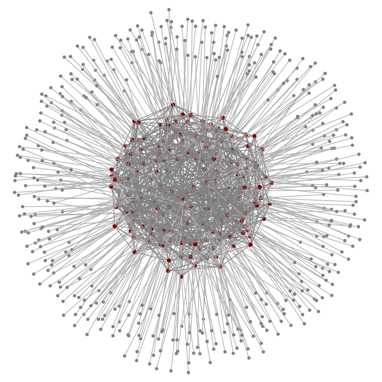
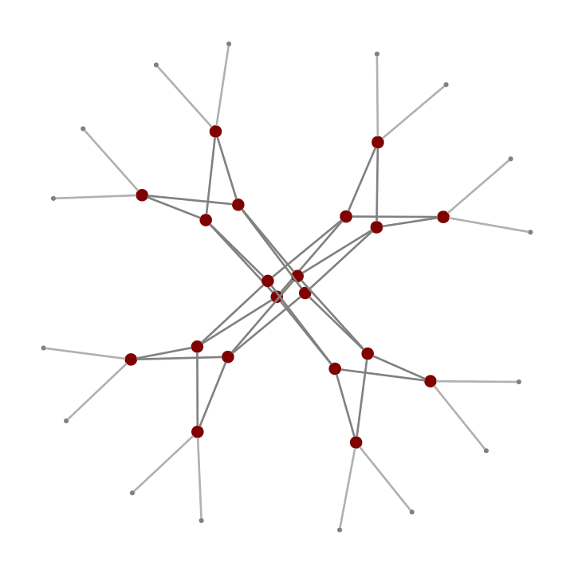

# Expander Data Center Networks

This site is a compendium of resources on expander graphs, including random graphs, for data center networks.

Traditionally, data center networks use tree-like topologies, particularly Clos networks, including fat trees and leaf-spine networks. But it turns out it's possible to do significantly better: expander graphs provide higher throughput, construction flexibility, and better resilience. A series of recent work, beginning with the Jellyfish project at the University of Illinois, proposed these topologies, demonstrated improved performance corresponding to 20-50% lower cost, and explored systems challenges including approaches to routing and physical cabling. In 2026, Amazon Web Services announced deployment of random graphs as the default architecture for new data center build-outs, realizing the topology's efficiency with 45% lower cost than Clos networks.

Here, we bring together research and resources on expander-based data centers, highlighting key contributions and relationships between them. The goal is to provide a picture of known techniques and results to assist future research, teaching, and industry adoption. This site is curated by [Brighten Godfrey](https://pbg.cs.illinois.edu/). Comments and contributions are welcome via email or opening an [issue](https://github.com/expander-dcn/expander-dcn.github.io/issues) in the repo.

| Table of Contents |
| --------------- |
| [Technical Overview](#technical-overview) |
| [Key Research Papers and Results](#key-research-papers-and-results) |
| [Talks and Lecture Slides](#talks-and-lecture-slides) |
| [Simulators and Data Sets](#simulators-and-data-sets) | 

# Technical Overview

### Background

There is a long history of designing network topologies, particularly in the areas of switching networks and high performance computing. As cloud computing scaled out and its workloads drove the need for high throughput, data centers drew from that literature. In particular, the Clos network became ubiquitous, in various forms such as 3-layer [fat trees](http://ccr.sigcomm.org/online/files/p63-alfares.pdf) and 2-layer leaf-spine networks. These networks can scale out, but at relatively high cost and with somewhat rigid design parameters to meet the network's structure. There has thus been a continuous need to support higher scale more efficiently. Furthermore, new design points (beyond the topologies developed in past generations of technology) are feasible because data centers have more flexible control planes and data planes than past generations of networks.

### What An Expander Is

An [expander graph](https://en.wikipedia.org/wiki/Expander_graph) has high connectivity exiting any subset of nodes, compared to the size of the subset. More precisely, let's say we have a graph $$G$$ with $$n$$ nodes $$V$$, and all the nodes have degree $$d$$ (meaning they all have $$d$$ outgoing edges). For any subset of nodes $$S\subseteq V$$, let $$\delta(S)$$ denote the set of edges which cross from inside to outside of $$S$$. Then the edge expansion of $$G$$ is defined as

$$
h(G) = \min_{S \subseteq V, |S|\leq \frac{n}{2}} \frac{|\delta(S)|}{|S|}
$$

(The notation $$\lvert S \rvert$$ means the size of set $$S$$.) $$G$$ is considered an expander when its edge expansion is relatively large, meaning $$h(G) > c \cdot d$$ for some constant $$c>0$$. The largest possible edge expansion is $$c=\frac{1}{2}$$.

The easiest way to construct an expander is to simply pick edges uniform-randomly. To see why this works, take $$S$$ to be half of the nodes. For any edge $$(u,v)$$ for which $$u \in S$$, there's a 50% chance ($$\frac{\lvert S \rvert}{n}$$) that the other end of the edge ($$v$$) lands outside of $$S$$. So in expectation, $$\delta(S)\geq \frac{1}{2} d \lvert S \rvert $$, and the actual value will tend to concentrate close to that mean, so that a random graph is close to the best possible expander. In a sense, the graph has _diverse_ connections, and this means there are no small cuts. Deterministic constructions of expanders also exist.

### What Expanders Offer

For a data center network fabric, expander graphs offer several benefits:

* **Throughput:** Expanders support higher throughput per server or more servers with the same equipment (switches and links), or the same throughput with less equipment. The amount of advantage depends on many factors but is often in the range of 25-100% higher throughput than a Clos network.
* **Resilience:** In a Clos network, loss of individual links or switches can result in disproportionately high throughput drop. In an expander, throughput degrades more gracefully -- roughly equal to the fraction of links failed.
* **Path length:** Expanders have low shortest path length -- within a few percent of the best possible. In a 3-layer fat tree, most server-to-server paths have length 6; in a high quality expander (like a uniform random graph) most paths will be of length 4 or 5, with a maximum of 6.
* **Flexible construction:** Most structured topologies have specific design parameters involving $$d$$, $$n$$, and the number of servers. Randomized constructions of expanders offer particular flexibility, working with any number of servers or switches, any degree, and switches of heterogeneous degree and line speed. They can also be expanded after construction with link swaps.

### Why It Works

It may be counterintuitive that starting with a carefully-structured Clos and then randomly rewiring it actually _improves_ performance. What's going on?  Resilience, path length, and throughput are actually closely related.

**Resilience** might be the easiest to see. Because any set of nodes has many outgoing connections, losing one of those links has less impact. Furthermore, in random graphs and most other expander constructions, every node has the same structural role, so no particular link or node has outsize impact if it fails.

**Path lengths** are short because connections are diverse. This is a lot like the "six degrees of separation" phenomenon: any two people on Earth are connected by a short chain of friends, because typically we have many diverse (even random!) acquaintances. In contrast, a Clos network has many links that provide redundancy but connect similar groups of switches, missing the opportunity to use those links to shorten paths.

<figure style="float: right; width: 33%; margin: 0 0 15px 15px;">
  
  <figcaption style="text-align: center; margin-top: 8px;">
    <em>In a Clos network, you can remove most of the network links without affecting any server-to-server path lengths. Those links were not helping to shortne paths – a missed opportunity.</em>
  </figcaption>
</figure>

**Throughput** is more subtle. [Throughput is not the same as bisection bandwidth](#jyothi16throughput) or other cut metrics alone. Intuitively, there are two important limits:

* **Sparsest cut:** The maximum throughput between two sets of servers is limited by the minimum cut between them.
* **Total capacity:** Regardless of which links carry traffic, total network throughput is limited by the total capacity:

$$
t \leq \frac{\sum_{e\in E} c(e)}{\ell},
$$

where $$t$$ is the throughput summed across all node-pairs, $$c(e)$$ is the capacity of edge $$e$$, and $$\ell$$ is the average path length of flows.  $$\ell$$ is important: a 4-hop 100 Gbps flow, for example, uses twice as much capacity as a 2-hop 100 Gbps flow.

Either of the above could be the limiting factor – and expanders are near-optimal in both regimes. In the cut-limited regime, expanders avoid cut bottlenecks by definition, since they have high edge expansion. This means they are good at routing flows to wherever capacity happens to be available, which has been called "throughput flexibility" or "capacity fungibility".

In fact, this flexibility can be so good that the network moves into a regime where it is limited not by any particular cut, but instead by total capacity (this is especially likely with traffic patterns like all-to-all). In this regime, the network is saturated, and one can think of capacity as a "fluid", able to be shifted to serve any of the traffic. Here, expanders are near-optimal because their low path length uses that fluid capacity as efficiently as possible.

### System Proposals

Jellyfish, NSDI'14, RNG

Xpander

Slim Fly, ESA 2018

Cross-cutting (performance & beyond): SIGCOMM'17, SC'16, Starfish NSDI'26

### Routing

Key challenges: non-shortest paths; oblivious vs. dynamic

k-shortest paths, k-disjoint paths, shortest-union-k, spraypoint (oblivious)

hybrid, controller-based (dynamic)

### Physical Cabling

Bundling across clusters

Fewer cables

Patch panels and ShuffleBoxes

Deterministic

# Key Research Papers and Results

### Systems and System Evaluations

* **[Jellyfish: Networking Data Centers Randomly](https://www.usenix.org/conference/nsdi12/technical-sessions/presentation/singla).** Ankit Singla, Chi-Yao Hong, Lucian Popa, and P. Brighten Godfrey. 9th USENIX Symposium on Networked Systems Design and Implementation (NSDI), April 2012. \[[Earlier version in HotCloud 2011](https://dl.acm.org/doi/10.5555/2170444.2170456)\] \[[Blog post](https://youinfinitesnake.blogspot.com/2012/04/jellyfish-networking-data-centers.html)\]
  * Introduced the idea of using a degree-bounded random graph as the data center network topology, leading to better throughput and greater flexibility in construction compared to Clos networks (fat trees). In particular, the paper showed 25% higher throughput than Clos networks for the workloads it considered, 60% lower incremental expansion cost for a particular model of incremental expansion, and better resilience to failed components.
  * Compared throughput with degree-diameter optimal (Moore bound) graphs, as a benchmark of an optimal topology, finding Jellyfish comes within 10% of their throughput. (See discussion of Moore graphs elsewhere on this page.)
  * Proposed approaches to deployment challenges: routing with k-shortest paths, and simplifying cabling via physical switch placement, patch panels providing the random matchings, and clustering with fewer cross-cluster links and bundling cables

* **[High Throughput Data Center Topology Design](https://www.usenix.org/conference/nsdi14/technical-sessions/presentation/singla).** Ankit Singla, P. Brighten Godfrey, and Alexandra Kolla. 11th USENIX Symposium on Networked Systems Design and Implementation (NSDI), April 2014.
  * Evaluates how close to optimal homogeneous random graphs are: Jellyfish closely approaches an analytical upper bound with a dense (all-to-all) traffic matrix; in other cases it ranges up to around 30% from the bound. Path length is within a few percent of the lower bound and approaches optimal with increased scale.
  * Studies how to configure connectivity in random graphs with heterogeneous degree and line speed.
  * Theoretically explains the effect (previously noted in the Jellyfish paper) that connectivity can be reduced between clusters of switches without impacting throughput.
  * Shows that randomizing the VL2 topology, which has heterogeneous line speeds and degrees, improves throughput by 43% (depending on exact topology and workload parameters, this could be more or less).

* **[Slim Fly: A Cost Effective Low-Diameter Network Topology](https://spcl.inf.ethz.ch/Publications/.pdf/sf_sc_2014.pdf).** Maciej Besta and Torsten Hoefler. International Conference on High Performance Computing, Networking, Storage and Analysis, November 2014 (SC 2014).
  * _Summary forthcoming_

* **[Measuring and Understanding Throughput of Network Topologies](https://pbg.cs.illinois.edu/papers/jyothi16throughput.pdf).**  Sangeetha Abdu Jyothi, Ankit Singla, P. Brighten Godfrey, and Alexandra Kolla. ACM/IEEE International Conference for High Performance Computing, Networking, Storage and Analysis (SC), November 2016.
  * Demonstrates that cut-metrics, like bisection bandwidth and sparsest cut, are the wrong metrics for throughput. In fact, they can be asymptotically wrong: there are networks A and B, where A has a higher cut and B has asymptotically higher throughput.
  * Instead, proposes to measure worst-case throughput with an efficient algorithm to generate a near-worst-case traffic matrix for any given topology.
  * Benchmarks a wide range of topologies using worst-case and common-case traffic, including: BCube, DCell, Dragonfly, Fat Tree, Flattened Butterfly, Hypercube, HyperX, Jellyfish, Long Hop, and Slim Fly. At small scale, DCell performs well. At moderate to large scale (>1000 servers) the expanders -- Jellyfish, Long Hop, and Slim Fly -- perform best, with Jellyfish and Long Hop handling worst-case traffic best. Fat trees perform particularly poorly with nonuniform traffic, around half the throughput of Jellyfish.

* **[Xpander: Towards Optimal-Performance Datacenters](https://dl.acm.org/doi/10.1145/2999572.2999580).** Asaf Valadarsky, Gal Shahaf, Michael Dinitz, and Michael Schapira. ACM CoNEXT 2016. ([Prior version](https://dl.acm.org/doi/10.1145/2834050.2834059) in HotNets 2015. [Project page](https://husant.github.io/Xpander/).)
  * Proposes Xpander, a deterministic expander graph construction for a data center network based on 2-lifts which can be incrementally expanded.
  * First paper that shows that several recently proposed data center topologies perform well because they are expanders -- in particular showing Jellyfish, Xpander, and several other expander graph constructions have nearly identical throughput, path length, and failure resilience. Also shows Slim Fly has reasonably high expansion, though not quite as high as Jellyfish and Xpander.
  * Experiments with a hardware test (the first ever?) of an expander graph on a small testbed, showing better performance than fat trees.

* **[Beyond fat-trees without antennae, mirrors, and disco-balls](https://dl.acm.org/doi/10.1145/3098822.3098836).** Simon Kassing, Asaf Valadarsky, Gal Shahaf, Michael Schapira, and Ankit Singla. ACM SIGCOMM 2017. (Prior version: [Fat-FREE Topologies](https://dl.acm.org/doi/10.1145/3005745.3005747) in HotNets 2016.)
  * Defines a notion of "network flexibility", capturing how well a topology can use its overall capacity for hotspots that might appear anywhere (the 2026 RNG paper later referred to this as "capacity fungibility"). Shows that Clos networks have very poor flexibility, so that oversubscription will limit throughput even if only a small fraction of servers are communicating. Expanders have high flexibility, approaching the best possible.
  * Compares the flexibility of expanders with dynamically reconfigurable optical switches. Reconfigurable optical networks can change their topology to match whichever flows are "hot" at a given moment, but expanders have an effectively similar ability via routing traffic along diverse paths (which yeilds network flexibility). The two approaches can be comparable, or expanders can even perform better with some skewed traffic patterns.
  * Proposes a routing scheme for expanders, called Hybrid: packets of a flow are sent over shortest paths with ECMP until they hit a certain threshold of bytes sent, after which they are forwarded with Valiant Load Balancing (VLB) which redirects traffic through a random intermediate point to ensure a good spread of traffic across paths.

* **[Expander Datacenters: From Theory to Practice](https://arxiv.org/abs/1811.00212).** Vipul Harsh, Sangeetha Abdu Jyothi, Inderdeep Singh, P. Brighten Godfrey. arXiv, November 2018.
  * _Summary forthcoming_
  * Evaluates the effect of a broader set of traffic matrices (TMs), including a 2-dimensional sweep over TMs with varying number of client and server pairs which spans uniform and skewed patterns, and a TM from Facebook. Finds that the expander's performance advantage over Clos can be large, even 2-4x, especially with oversubscription in the Clos.
  * Evaluates k-disjoint path routing, which can be implemented with segment routing and offers...
  * Implements a random graph in a hardware testbed

* **[A High-Performance Design, Implementation, Deployment, and Evaluation of The Slim Fly Network](https://www.usenix.org/conference/nsdi24/presentation/blach)**. Nils Blach, Maciej Besta, Daniele De Sensi, Jens Domke, Hussein Harake, Shigang Li, Patrick Iff, Marek Konieczny, Kartik Lakhotia, Ales Kubicek, Marcel Ferrari, Fabrizio Petrini, and Torsten Hoefler. USENIX NSDI 2024.
  * _Summary forthcoming_

* **[Starfish: A Topology-Routing Co-Design for Small-Scale Data Centers](https://www.usenix.org/conference/nsdi26/presentation/zhou-starfish).** Anchengcheng Zhou, Vipul Harsh, Sangeetha Abdu Jyothi, Maria Apostolaki, and P. Brighten Godfrey. 23rd USENIX Symposium on Networked Systems Design and Implementation (NSDI), May 2026. (Prior version: [Spineless Data Centers](https://dl.acm.org/doi/10.1145/3422604.3425945) in HotNets 2020.)
  * Introduces the DRing topology, which has a simple regular deterministic structure that may ease wiring, and at small scale, performs as well as Jellyfish and sometimes better. DRing does not perform well at high scale, illustrating that small-scale topology design offers new design points.
  * Introduces a practical routing scheme for flat networks including Jellyfish and DRing, easily implementable with standard switch features (BGP and VRFs) that performs well when used with ECMP and better with centrally-optimized weights.
  * Shows that leaf-spine is suboptimal for throughput, with flat networks including Jellyfish and DRing achieving >50% higher throughput.  Past work had focused on improving larger 3-tier Clos networks (fat trees), rather than leaf-spine which is used commonly in smaller data centers.

* **[RNG: Flat Datacenter Networks at Scale](https://arxiv.org/abs/2604.15261).** Giacomo Bernardi, Ratul Mahajan, C. Seshadhri, Enrico Carlesso, Chinchu Merine Joseph, Saurabh Kumar, Pavan Manikonda, Luiza Popa, Randy Ram, Steven Robinson, Elizabeth Tennent. arXiv, May 2026.
  * Describes the first production deployment of random graphs (also the first deployment of any expander based data center) at Amazon Web Services, where it is "now the default datacenter network for most workloads at Amazon".
  * Uses 45% fewer switches than fat trees (with a corresponding 45% cost reduction), while matching or exceeding fat tree performance.
  * Addresses deployment challenges: (1) spraypoint routing to provide diverse paths with limited router memory, (2) passive optical devices called ShuffleBoxes, used as intermediate panels to ease wiring and incremental addition of racks, (3) analytical models to assist operator capacity planning.

### Expanders in Reconfigurable Optical Networks

* **[Expanding across time to deliver bandwidth efficiency and low latency](https://cseweb.ucsd.edu/~snoeren/papers/opera-nsdi20.pdf).** William M. Mellette, Rajdeep Das, Yibo Guo, Rob McGuinness, Alex C. Snoeren, and George Porter. USENIX NSDI 2020.
  * _Summary forthcoming_

* **[Flexspander: augmenting expander networks in high-performance systems with optical bandwidth steering](https://ieeexplore.ieee.org/document/9019590).** Min Yee Teh, Zhenguo Wu, and Keren Bergman. Journal of Optical Communications and Networking, March 2020.
  * _Summary forthcoming_

* **[Cerberus: The Power of Choices in Datacenter Topology Design (A Throughput Perspective)](https://people.csail.mit.edu/ghobadi/papers/cerberus_sigmetrics_2022.pdf).** Chen Griner, Johannes Zerwas, Andreas Blenk, Manya Ghobadi, Stefan Schmid, and Chen Avin. ACM SIGMETRICS 2022.
  * _Summary forthcoming_

### Theoretical Background

* **[Approximate Moore Graphs are good expanders](https://dl.acm.org/doi/10.1016/j.jctb.2019.08.003).** Michael Dinitz, Michael Schapira, and Gal Shahaf. Journal of Combinatorial Theory Series B, Vol. 141, No. C, 2020. An earlier version appeared in ESA 2018.
  * Two major measures of topology optimality are (1) graph expansion and (2) approaching the Moore bound, which bounds the maximum number of nodes for a given degree and diameter. These have served as inspiration or explanation for data center and HPC network topology design.
  * Showed that the two major measures of optimality are actually fundamentally connected: it is easily seen that good expanders have low diameter; here it is shown that graphs with low diameter (for a given number of nodes and degree) are also forced to be good expanders.

# Talks and Lecture Slides

Individual papers above have links to their talks. This list includes talks and lectures covering broader overviews.

* Lecture slides: Coming sometime in August 2026. Contact Brighten Godfrey if you're interested in them.
* [Networking Data Centers Randomly](https://www.youtube.com/watch?v=yEjcZC34qNo). Brighten Godfrey. Talk at Texas A&M University, November 14, 2013.

# Simulators and Data Sets

* [Topobench](https://github.com/ankitsingla/topobench-1): topology comparison tool used in Jellyfish (NSDI'12) and later extended in several papers (NSDI'14, SC'16, HotNets'16). Uses a multicommodity flow analysis -- that is, modeling network flow as a fluid rather than a packet-level simulation.
* [NetBench](https://github.com/ndal-eth/netbench): packet level simulator from Beyond Fat-Trees (SIGCOMM'17).
* [Starfish simulator](https://github.com/AnnZhouCcc/Starfish): packet level simulator from Starfish (NSDI'26), which also includes other topologies for comparison.

# Acknowledgements

The Jellyfish project was funded by the National Science Foundation and a gift from Cisco Systems. Thanks to Sangeetha Abdu Jyothi, Vipul Harsh,  and Ankit Singla for useful comments on this site.

